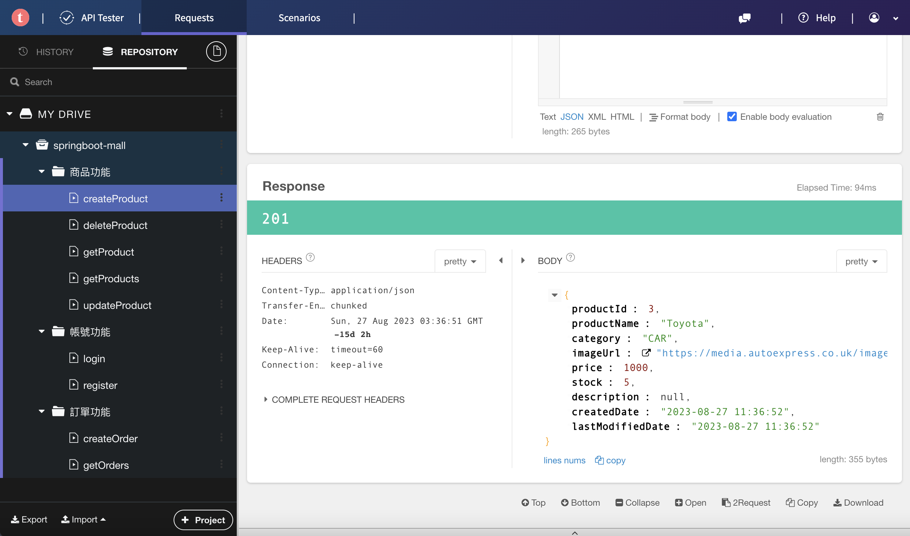
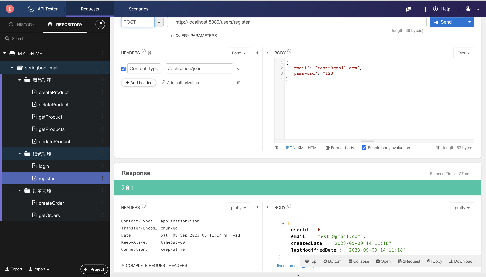
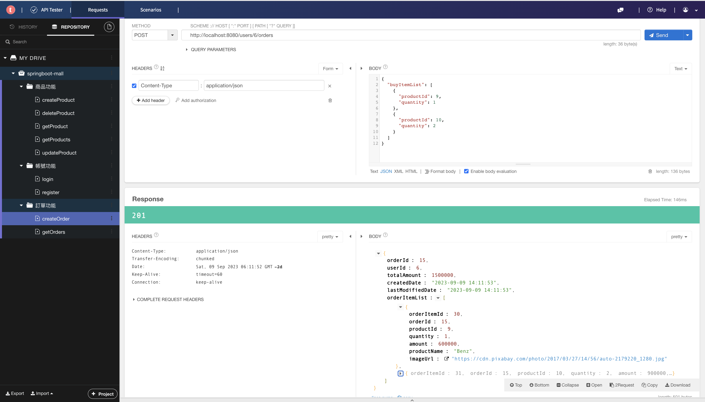
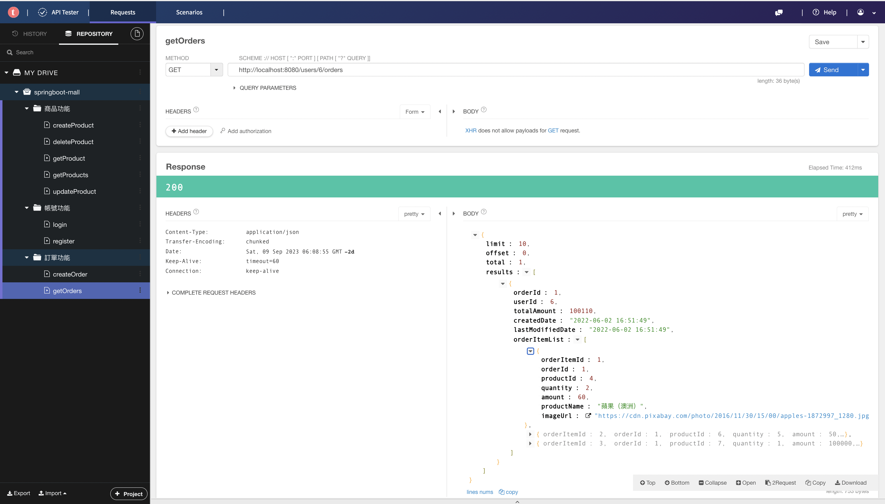

# 簡易電商平台實作
## 實作內容：
- 商品功能
  - 新增/查詢/修改/刪除商品(CRUD)
  - 查詢商品列表（關鍵字、商品分類查詢)
- 帳號功能
  - 註冊新帳號
  - 登入
- 訂單功能
  - 創建訂單
  - 查詢訂單列表
 
## 功能介紹與圖示

### 商品功能：
- 新增/查詢/修改/刪除商品(CRUD)

> 新增功能API


- 查詢商品列表（關鍵字、商品分類查詢)

> 使用者可以依照商品分類、關鍵字搜尋商品

.png)

### 帳號功能：

> 註冊帳號使用 MD5加密密碼，並不顯示密碼出來，防止帳號洩密

- 註冊新帳號
- 登入
```bash
帳號： test1@gmail.com
密碼： 123
```


### 訂單功能：
- 創建訂單
> 根據已創建的帳號購買商城裡有的商品訂單


- 查詢訂單列表
> 查看此帳號所有購買的商品訂單



### 各單元皆有單元測試（Unit Testing)

### 使用技術：

- Spring Boot版本：2.3.7.RELEASE（RESTful設計原則)、Controller-Service-Dao三層式架構
- Spring JDBC
- MySQL版本：8.0.22
  - 單元測試使用 H2 database
- 單元測試版本：JUnit 5
